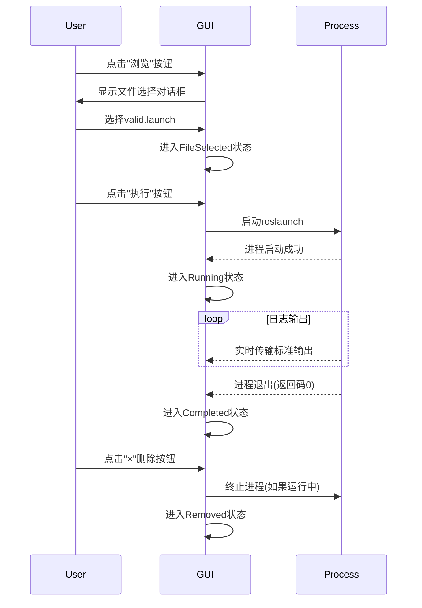

## 结构框图  


## 代码讲解  
以下是基于Mermaid状态图的核心逻辑代码实现，结合状态图的关键部分进行详细说明：


### 状态图关键部分与代码对应关系

#### Idle 状态
- **描述**：初始状态，未选择有效launch文件。
- **关键代码**：

  ```cpp
  // LaunchItem构造函数
  LaunchItem::LaunchItem(QWidget *parent) : 
      QWidget(parent), ui(new Ui::LaunchItem), process(new QProcess(this)) {
    
      ui->setupUi(this);
      ui->lineEdit->clear(); // 清空路径输入框
      ui->textEdit->clear();  // 清空输出窗口
  }
  ```


#### FileSelected 状态
- **描述**：用户通过浏览按钮选择了一个有效的launch文件。
- **关键代码**：

  ```cpp
  void LaunchItem::onBrowseClicked() {
      QString path = QFileDialog::getOpenFileName(
          this, "选择Launch文件", 
          QDir::homePath(), 
          "ROS Launch Files (*.launch)"
      );
      if (!path.isEmpty()) {
          ui->lineEdit->setText(path); // 更新路径输入框
          // 此时进入FileSelected状态
      }
  }
  ```



#### Executing 状态
- **描述**：用户点击“执行”按钮，尝试启动roslaunch进程。
- **关键代码**：

  ```cpp
  void LaunchItem::onExecuteClicked() {
      QString launchPath = ui->lineEdit->text();
      if (launchPath.isEmpty() || !QFile::exists(launchPath)) {
          ui->textEdit->append("错误：无效的launch文件路径");
          return; // 进入Error状态
      }

      QString cmd = QString("source /opt/ros/noetic/setup.bash && roslaunch %1")
                    .arg(launchPath);
    
      process->start("bash", QStringList() << "-c" << cmd);
      // 进入Executing状态
  }
  ```



#### Running 状态
- **描述**：roslaunch进程成功启动，正在运行并输出日志。
- **关键代码**：

  ```cpp
  void LaunchItem::readProcessOutput() {
      QString output = process->readAllStandardOutput();
      QString error = process->readAllStandardError();
    
      if (!output.isEmpty()) {
          ui->textEdit->append(output); // 实时输出标准日志
      }
      if (!error.isEmpty()) {
          ui->textEdit->setTextColor(Qt::red);
          ui->textEdit->append(error);  // 实时输出错误日志
          ui->textEdit->setTextColor(Qt::black);
      }
  }
  ```



#### Completed 状态
- **描述**：roslaunch进程正常退出（返回码0）。
- **关键代码**：

  ```cpp
  connect(process, QOverload<int>::of(&QProcess::finished), [this](int exitCode) {
      if (exitCode == 0) {
          ui->textEdit->append("进程正常退出");
          // 进入Completed状态
      } else {
          ui->textEdit->append("进程异常退出，返回码: " + QString::number(exitCode));
          // 进入Error状态
      }
  });
  ```



#### Error 状态
- **描述**：出现错误（无效路径或进程异常退出）。
- **关键代码**：

  ```cpp
  void LaunchItem::onExecuteClicked() {
      QString launchPath = ui->lineEdit->text();
      if (launchPath.isEmpty() || !QFile::exists(launchPath)) {
          ui->textEdit->append("错误：无效的launch文件路径");
          // 进入Error状态
          return;
      }
      // ...
  }
  ```



#### Removed 状态
- **描述**：用户点击“×”按钮，删除当前LaunchItem。
- **关键代码**：

  ```cpp
  void LaunchItem::removeLaunchItem(QWidget *item) {
      if (process->state() == QProcess::Running) {
          process->terminate(); // 终止进程
          process->waitForFinished(1000);
      }
      item->deleteLater(); // 删除UI组件
      // 进入Removed状态
  }
  ```



### 状态流转的核心逻辑

#### 从 Idle 到 FileSelected
- **触发条件**：用户通过浏览按钮选择了一个有效的launch文件。
- **代码实现**：

  ```cpp
  void LaunchItem::onBrowseClicked() {
      QString path = QFileDialog::getOpenFileName(...);
      if (!path.isEmpty()) {
          ui->lineEdit->setText(path); // 更新路径输入框
          // 进入FileSelected状态
      }
  }
  ```



#### 从 FileSelected 到 Executing
- **触发条件**：用户点击“执行”按钮。
- **代码实现**：

  ```cpp
  void LaunchItem::onExecuteClicked() {
      QString launchPath = ui->lineEdit->text();
      if (launchPath.isEmpty() || !QFile::exists(launchPath)) {
          ui->textEdit->append("错误：无效的launch文件路径");
          return; // 进入Error状态
      }
      process->start("bash", QStringList() << "-c" << cmd);
      // 进入Executing状态
  }
  ```



#### 从 Executing 到 Running
- **触发条件**：roslaunch进程成功启动。
- **代码实现**：

  ```cpp
  connect(process, &QProcess::started, [this] {
      ui->textEdit->append("进程已启动");
      // 进入Running状态
  });
  ```



#### 从 Running 到 Completed/Error
- **触发条件**：进程退出（正常或异常）。
- **代码实现**：

  ```cpp
  connect(process, QOverload<int>::of(&QProcess::finished), [this](int exitCode) {
      if (exitCode == 0) {
          ui->textEdit->append("进程正常退出");
          // 进入Completed状态
      } else {
          ui->textEdit->append("进程异常退出，返回码: " + QString::number(exitCode));
          // 进入Error状态
      }
  });
  ```



#### 从任何状态到 Removed
- **触发条件**：用户点击“×”按钮。
- **代码实现**：

  ```cpp
  connect(ui->btnRemove, &QPushButton::clicked, [this] {
      emit removeRequested(); // 通知主窗口删除当前item
      // 进入Removed状态
  });
  ```



### 核心逻辑总结

| **状态**       | **触发条件**                     | **关键代码**                                                                 |
|----------------|----------------------------------|------------------------------------------------------------------------------|
| Idle           | 初始化                          | `ui->lineEdit->clear(); ui->textEdit->clear();`                              |
| FileSelected   | 用户选择有效launch文件          | `ui->lineEdit->setText(path);`                                               |
| Executing      | 用户点击“执行”按钮              | `process->start("bash", QStringList() << "-c" << cmd);`                      |
| Running        | 进程成功启动                    | `connect(process, &QProcess::started, [this] { ... });`                      |
| Completed      | 进程正常退出（返回码0）         | `connect(process, QOverload<int>::of(&QProcess::finished), [this](int code) { ... });` |
| Error          | 无效路径或进程异常退出          | `ui->textEdit->append("错误：无效的launch文件路径");`                        |
| Removed        | 用户点击“×”按钮                | `item->deleteLater();`                                                       |


通过以上代码和状态流转的对应关系，可以清晰地理解整个系统的核心逻辑。如果需要进一步扩展功能（如批量执行、状态持久化等），可以基于此框架进行开发。

