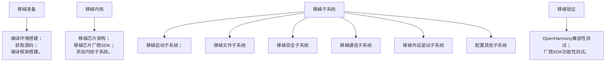

  
OpenHarmony移植到STM32H743系列-这是一个系列  
- [资源预览](../2025_03_19-openharmony_with_stm32h743)
- [术语含义](../2025_03_27-openharmony_glossary)
- [源码拉取](../2025_03_27-openharmony_source)
- [移植验证](../2025_03_27-openharmony_porting_minichip_overview):point_left: 你在这里


本篇内容源自[porting-minichip-overview](https://gitee.com/openharmony/docs/blob/master/zh-cn/device-dev/porting/porting-minichip-overview.md)此参考文档适用于OpenHarmony LTS 3.0.1及之前版本的轻量系统的适配，即对于我现在的5.0.3版本可能会有一定的差别，但是大体上是可以参考的。和[轻量系统STM32F407芯片移植案例](https://gitee.com/openharmony/docs/blob/master/zh-cn/device-dev/porting/porting-stm32f407-on-minisystem-eth.md)。
## 适配流程  

## 准备流程  
### 适配工具及其环境  
- [STM32CubeMX](https://gitee.com/link?target=https%3A%2F%2Fwww.st.com%2Fen%2Fdevelopment-tools%2Fstm32cubemx.html)：用于生成STM32H743的Makefile工程  
- Ubuntu 20.04：推荐环境  
- [arm-none-eabi-gcc](https://gitee.com/openharmony/device_board_talkweb/blob/master/niobe407/docs/software/%E5%BC%80%E5%8F%91%E7%8E%AF%E5%A2%83%E6%90%AD%E5%BB%BA%E4%B8%8E%E5%9B%BA%E4%BB%B6%E7%BC%96%E8%AF%91.md#6%E5%AE%89%E8%A3%85%E4%BA%A4%E5%8F%89%E7%BC%96%E8%AF%91%E5%B7%A5%E5%85%B7%E9%93%BE)：编译工具链，支持Cortex-M7  
- [PuTTY](https://www.putty.org/)：串口工具，用于调试输出信息

### 基础配置参数设置  
通过stm32cubemx工具生成STM32H743IIT6芯片的Makefile工程，在此给出如下配置建议：  
- 芯片型号：STM32H743IIT6  
- SYSCLK 设置：480MHz  
- 配置调试串口（如 USART1）  
- Toolchain 设置为 Makefile  

生成对应的工程目录文件结构为：  
```bash
├── Core
│   ├── Inc
│   │    ├── main.h
│   │    ├── stm32h7xx_hal_conf.h
│   │    ├── stm32h7xx_it.h
│   │    ├── usart.h
│   │    └── ...
│   └── Src
│        ├── main.c                --- 主函数
│        ├── stm32h7xx_hal_msp.c   --- HAL库弱函数配置文件
│        ├── stm32h7xx_it.c        --- 中断回调函数文件
│        ├── system_stm32h7xx.c    --- 系统
│        ├── usart.c               --- 串口
│        └── ...  
├── Drivers
│   ├── CMSIS                      --- CMSIS接口
│   └── STM32H7xx_HAL_Driver       --- HAL库驱动
├── Makefile                       --- Makefile编译
├── STM32H743xxx_FLASH.ld         --- 链接文件
├── startup_stm32h743xx.s          --- 启动文件
└── stm32h743_output.ioc           --- stm32cubemx工程文件
```

### 验证生成的Makefile工程  
将生成的工程文件拷贝到Ubuntu环境下，进入工程项目执行我们上述安装的make指令编译：
```bash  
arm-none-eabi-gcc \
  build/main.o \
  build/stm32h7xx_it.o \
  build/stm32h7xx_hal_msp.o \
  build/stm32h7xx_hal_tim.o \
  build/stm32h7xx_hal_tim_ex.o \
  build/stm32h7xx_hal_uart.o \
  build/stm32h7xx_hal_rcc.o \
  build/stm32h7xx_hal_rcc_ex.o \
  build/stm32h7xx_hal_flash.o \
  build/stm32h7xx_hal_flash_ex.o \
  build/stm32h7xx_hal_gpio.o \
  build/stm32h7xx_hal_dma.o \
  build/stm32h7xx_hal_dma_ex.o \
  build/stm32h7xx_hal_pwr.o \
  build/stm32h7xx_hal_pwr_ex.o \
  build/stm32h7xx_hal_cortex.o \
  build/stm32h7xx_hal.o \
  build/stm32h7xx_hal_exti.o \
  build/system_stm32h7xx.o \
  build/startup_stm32h743xx.o \
  -mcpu=cortex-m7 -mthumb -mfpu=fpv5-d16 -mfloat-abi=hard \
  -specs=nano.specs \
  -TSTM32H743ZITx_FLASH.ld \
  -lc -lm -lnosys \
  -Wl,-Map=build/stm32h743_output.map,--cref \
  -Wl,--gc-sections \
  -o build/stm32h743_output.elf
```
后处理编译命令：
```bash  
arm-none-eabi-size build/stm32h743_output.elf

arm-none-eabi-objcopy -O ihex build/stm32h743_output.elf build/stm32h743_output.hex

arm-none-eabi-objcopy -O binary -S build/stm32h743_output.elf build/stm32h743_output.bin
```
- .elf 是可执行文件  
- .hex 是可用于部分烧录器的格式  
- .bin 是常用于的裸二进制烧录文件  

### 配置printf到串口的输出  
为了验证开发版能够成功运行我们刚才编写的代码，我们可以在main()函数中添加以下的串口调试输出：

```c  
printf("hello world!!\r\n");
```


由于STM32的printf()默认不会输出到串口，需要重定向输出：

```h  
#include <stdio.h>
int _write(int fd, char *ptr, int len)
{ 
    return HAL_UART_Transmit(&huart1, (uint8_t *)ptr, len, 0xFFFF); 
}
```


重新编译代码，可以烧录至开发版中验证。  


## Openharmony编译构建  
### 构建芯片适配与产品样例目录  
```bash  
device/
├── board/
│   └── your_company/
│       └── your_board_h743/
│           └── liteos_m/        # H743 工程代码放这里
├── soc/
│   └── st/
│       └── stm32h7xx/
│           └── sdk/             # HAL Drivers、CMSIS 放这里

vendor/
└── your_company/
    └── your_board_h743/
        └── config.json          # 产品配置文件
```
获取对应的版本的[OpenHarmony源码](https://gitee.com/openharmony/docs/blob/master/zh-cn/device-dev/get-code/sourcecode-acquire.md)，创建上述对应文件夹。  

### 配置预编译支持  
#### 修改config.json  

```json  
{
  "product_name": "your_board_h743",
  "type": "mini",
  "version": "3.0",
  "device_company": "your_company",
  "board": "your_board_h743",
  "kernel_type": "liteos_m",
  "kernel_version": "3.0.0",
  "subsystems": []
}
```


#### 修改config.gni  

```gni  
kernel_type = "liteos_m"
kernel_version = "3.0.0"
board_cpu = "cortex-m7"
board_toolchain = "arm-none-eabi-gcc"
use_board_toolchain = true
board_toolchain_prefix = "arm-none-eabi-"
board_toolchain_type = "gcc"
board_opt_flags = [
    "-mcpu=cortex-m7",
    "-mthumb",
    "-mfpu=fpv5-d16",
    "-mfloat-abi=hard",
]
board_cflags = [ "-Og", "-Wall", "-DSTM32H743xx" ] + board_opt_flags
board_asmflags = board_cflags
board_ld_flags = board_opt_flags
```


#### 验证hb  
可以通过以下指令进行变量查看：
```bash  
hb set    # 查看可用产品编译选项  
hb env    # 查看选择的预编译环境变量  
```  

 `hb`是OpenHarmony为了方便开发者进行代码构建编译，提供的python脚本工具，其源码就在`//build/lite`仓库目录下。在执行`hb set`命令时，脚本会遍历`//vendor/<product_company>/<product_name>`目录下的`config.json`，给出可选产品编译选项。  
 在config.json文件中，`product_name`表示产品名，`device_company`和`board`用于关联出`//device/board/<device_company>/<board>`目录，匹配该目录下的`<any_dir_name>/config.gni`文件，其中`<any_dir_name>`目录名可以是任意名称，但建议将其命名为适配内核名称（如：liteos\_m、liteos\_a、linux）。  
 hb命令如果匹配到了多个`config.gni`，会将其中的`kernel_type`和`kernel_version`字段与`vendor/<device_company>`下`config.json`文件中的字段进行匹配，从而确定参与编译的`config.gni`文件。

至此，预编译适配完成，但工程还不能执行hb build进行编译，还需要准备好后续的LiteOS-M内核移植。

## 内核移植  

